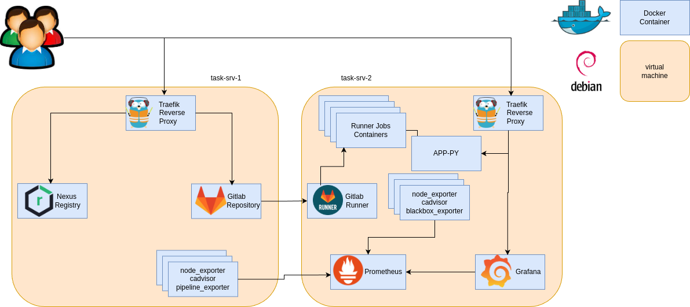
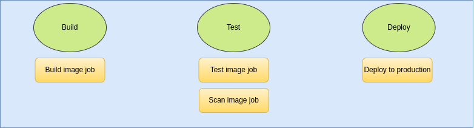

# Nadin Soft Task
## Overview
Wellcome to my projject this project is designed to implement a simple python web service and its repository, pipeline, and observability. 
The task sent to me is as follows:

## Steps to perform the task
### [STEP 1](simple-app) Containerize a simple Python web service with Docker Compose
### [STEP 2](### Gitlab-CI/CD) Build and configure a GitLab CI/CD pipeline to build, test, and deploy the servic 
### [STEP 3](monitoring) Instrument the service for Prometheus monitoring and configure alerting 
### [STEP 4]() Apply iptables rules to restrict external access and demonstrate restart policies. 

## Project design:

For this scenario we have two servers which we will call task-srv-1 and task-srv-2 and due to the number of internet edges we need a reverse proxy on each server. I choose traefik because it is very easy to implement. And nginx or haproxy should be changed for each service or backend which will be managed with some tags in traefik.
#### TLD of project:

## Gitlab CI/CD

### creating a design for the CI/CD process and pipeline structure
Based on the task task, we need three stages
- build
- test
- deploy

#### Build

#### Test

#### Deploy

#### Deliverables Git repository containing:
- [x] Dockerfile, docker-compose.yml
- [x] .gitlab-ci.yml
- [ ] Prometheus & Alertmanager configs
- [ ] README.md with setup, pipeline trigger, and failure-recovery instructions
#### Screenshots/logs:
- [x] Successful service start via Compose
- [ ] Passing CI pipeline stages
- [ ] Prometheus/Grafana dashboards & triggered alerts
- [ ] iptables rules verification
- [x] Container auto-restart after kill
