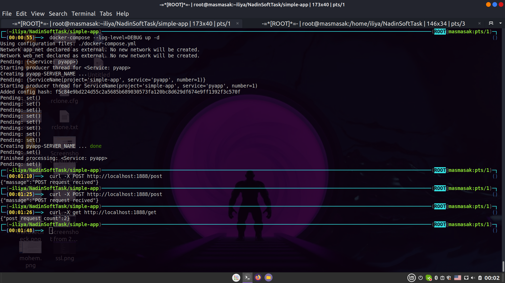
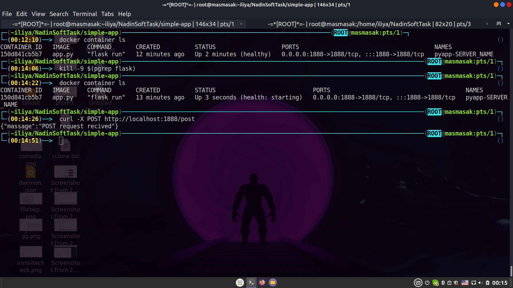

# simple python web service

## Steps taken:

### Create simple python web service
  Since I'm not familiar with Python, I created a very simple web service and named it app.py which listens on port 1888 that counts the number of post requests and displays it in the Get request (it would be preferable to store the data in a database that is both persistent and scalable and stateless).
### Containerize app.py
  I used the Python Slim base image and added the curl package to it to write healthcheck.
### write compose file
 - In the compose file, I added two networks web_net and app_net to the container 
 - since the data is not persistent, there was no need for valume. 
 - I wrote a simple example of health check. 
 - I put all the variables in the .env file.
### test the app,compose,and restart policy
  At this point, I deployed the app using Compose and tested it using curl.

Then I killed its main process to make sure the restart policy was working properly.

### change docker compose
  Finally, depending on our scenario, we will remove the port from Docker Compose and add traefik labels instead.
